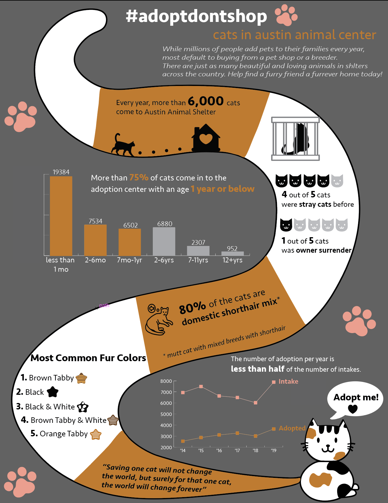

Hello All! Here is a demonstration of what a basic webpage would look like after embedding the visualization using the tools we learned so far: Vega-lite, Tableau, AD, and D3 

<html>

<h2>Vega-Lite</h2>
Observable allows you to embed the visualizations you created easily onto other sites. On the cell of the visualization, click on the three dots located on the left side and select "Embed". If for some reason you do not see this button, go to the very top of the page, click three dots on the right side and select "Switch to Classic"
Once you copy the code for the embedded visualization, simply copy the code inside html tag. Same process for D3. 
  <iframe width="100%" height="323" frameborder="0"
  src="https://observablehq.com/embed/@info247-spring21/vega-lite-assignment-solution?cells=ex3"></iframe>
  
<h2>Tableau</h2>
In order to embed your Tableau dashboard to the sites, you will first have to publish your worksheet to [Tableau Public](https://public.tableau.com/en-us/s/). Once you publish, similar to above step, you will need to copy the embedded html code and paste it here. 

  
<noscript></noscript><object class='tableauViz'  style='display:none;'><param name='host_url' value='https%3A%2F%2Fpublic.tableau.com%2F' /> <param name='embed_code_version' value='3' /> <param name='site_root' value='' /><param name='name' value='Conspiracy_Score&#47;Dashboard1' /><param name='tabs' value='no' /><param name='toolbar' value='yes' /><param name='static_image' value='https:&#47;&#47;public.tableau.com&#47;static&#47;images&#47;Co&#47;Conspiracy_Score&#47;Dashboard1&#47;1.png' /> <param name='animate_transition' value='yes' /><param name='display_static_image' value='yes' /><param name='display_spinner' value='yes' /><param name='display_overlay' value='yes' /><param name='display_count' value='yes' /><param name='language' value='en' /></object>
                

<h2>Images (Infographic in this case) </h2>
If you'd like to put simple images, you can upload the image file to your repository and use img html tag and put the source. 

<h2>D3</h2>
Same process as Vega-Lite using embedding from Observable notebook. 
  <iframe width="100%" height="184" frameborder="0"
  src="https://observablehq.com/embed/@chunggrace/lab-12-d3-practice-3-interactivity?cells=singleVote"></iframe>

</html>
